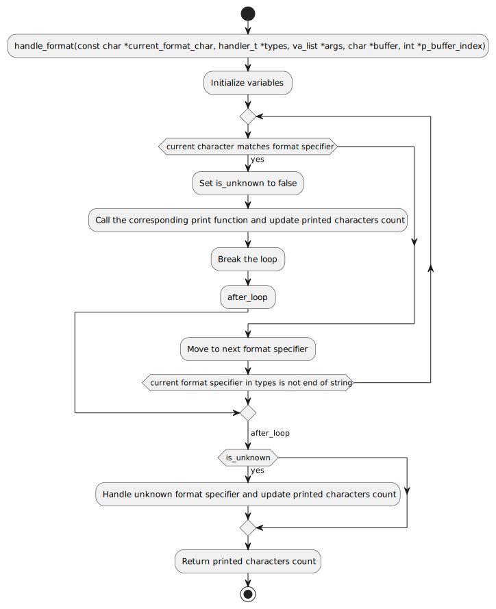

# Holberton School - Custom `_printf` Implementation

Welcome to the custom implementation of the `_printf` function! This project is a simplified version of the standard C library `printf` function, focusing on foundational concepts and formatted output functionality.

## Learning Objectives
Through this project, you will learn:
- The basics of formatted output handling in C.
- Efficient memory usage via buffers.
- Modular programming with separate handlers for specifiers.
- Debugging and testing a custom implementation of a standard library function.

---

## Features
### Key Characteristics
- **Internal Buffer**: Utilizes a fixed 1024-byte buffer to optimize output operations.
- **Error Handling**: Returns `-1` if the format string is `NULL`.
- **Lightweight Implementation**: Focuses on simple structures and minimal memory footprint.

### Limitations
- **No Advanced Formatting**: Does not support field width, precision, or flags like `+`, `-`, or `0`.
- **Limited Specifiers**: Only supports a few basic format specifiers.
- **Fixed Buffer Size**: Outputs exceeding 1024 bytes are flushed incrementally.

---

## Supported Format Specifiers
| **Specifier** | **Functionality**                                  |
|---------------|----------------------------------------------------|
| `%c`          | Prints a single character.                         |
| `%s`          | Prints a string.                                   |
| `%d`, `%i`    | Prints an integer in decimal notation (signed).    |
| `%%`          | Prints a literal `%` character.                    |

Unsupported specifiers are printed as `%<unknown>`.

---

## File Structure

### Core Files
1. **`_printf.c`**  
   Contains the main implementation of the `_printf` function:
   int _printf(const char * const format, ...);

2. **`handler.c`**  
   Validates the format of arguments passed to `_printf`.

3. **Specifier Handlers**  
   Individual functions for handling supported specifiers.

4. **Buffer Management**  
   - `void flush_buffer(char *buffer, int *p_buffer_index);`  
     Flushes the buffer content to standard output.
   - `void append_to_buffer(char *buffer, int *p_buffer_index, char c);`  
     Appends characters to the buffer.

5. **`main.h`**  
   The header file containing prototypes and shared structures.

### Compilation
To compile the code, use the following flags:
gcc -Wall -Werror -Wextra -pedantic -std=gnu89 -Wno-format *.c

---

## How to Use

1. Clone the repository:
   git clone https://github.com/andreamarquez/holbertonschool-printf.git

2. Navigate to the project directory:
   cd holbertonschool-printf

3. Compile the project using the provided `gcc` flags:
   gcc -Wall -Werror -Wextra -pedantic -std=gnu89 -Wno-format *.c

4. Include `_printf` in your code:
   #include "main.h"

   int main(void)
   {
       _printf("Hello, %s!\n", "world");
       return 0;
   }

5. Execute the compiled program:
   ./a.out

---

## Testing

To test the _printf function, you can create a main.c file in the project directory. It must serve as the entry point of a C program and have a '.c' extension. Below is a template for this file:

```c
#include <stdio.h>
#include <stdlib.h>
#include "main.h"
/**
 * main - Entry point
 *
 * Return: 0 on success, error code otherwise
 */
int main(void)
{
	int len, len2;
	len = _printf("%");
	len2 = printf("%");
	fflush(stdout);
	if (len != len2)
	{
		printf("Lengths differ.\n");
		fflush(stdout);
		return (1);
	}
	return (0);
}
```

## Help and Documentation

For more details, refer to the provided `man_3_printf` file. If additional help is required, contact the authors at:
- 9815@holbertonstudents.com
- 9948@holbertonstudents.com

### Flowchart
In this README file, only the diagrams for the printf and handle_format functions are specified. For more details, 
refer to the provided `flow-charts` directory.
printf


handle_format




---

### Authors
This project was created and maintained by:
- **Student 9815 / Raphael DOTT**
- **Student 9948 / Andrea MARQUEZ**

---

### License
This project is open-source and available for educational purposes.
